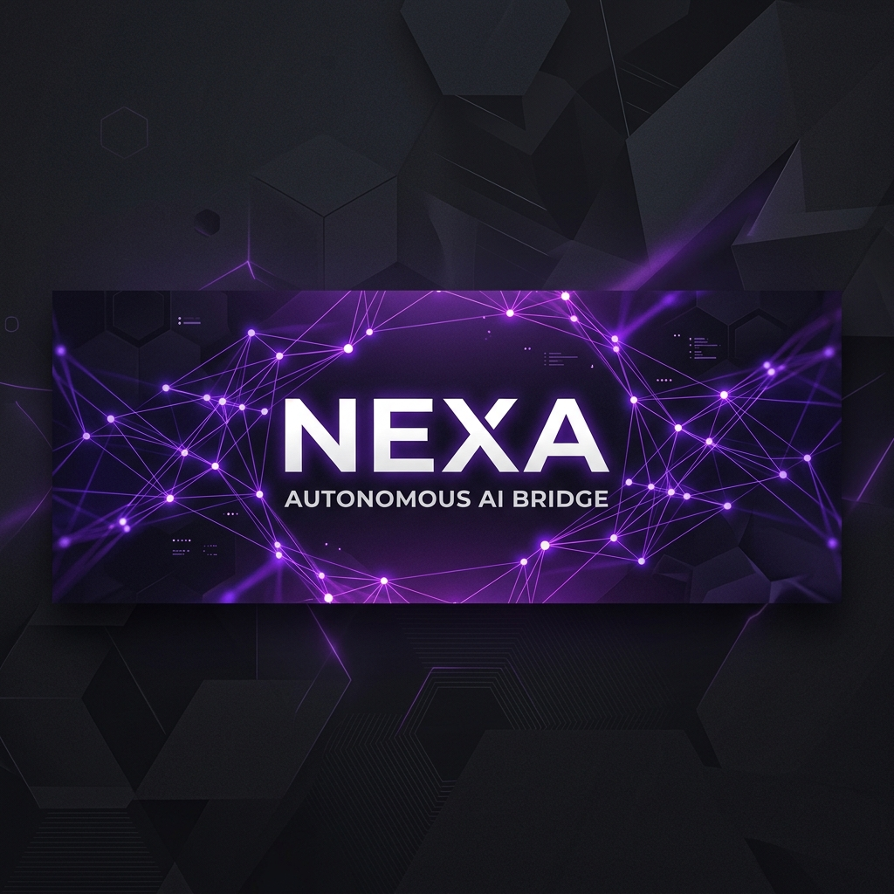
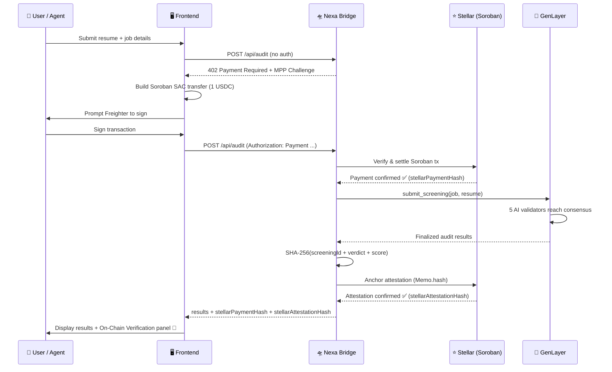

<p align="center">
  
</p>

<h1 align="center">Nexa — Autonomous AI Bridge</h1>

<p align="center">
  <strong>AI agents pay USDC on Stellar to get consensus-driven resume audits on GenLayer.</strong>
</p>

<p align="center">
  <a href="https://stellar.org"></a>
  <a href="https://genlayer.com"></a>
  <a href="https://paymentauth.org"></a>
  
</p>

<p align="center">
  <a href="#-quick-start">Quick Start</a> •
  <a href="#-architecture">Architecture</a> •
  <a href="#-how-it-works">How It Works</a> •
  <a href="#-project-structure">Project Structure</a> •
  <a href="#%EF%B8%8F-configuration">Configuration</a> •
  <a href="#-scripts">Scripts</a> •
  <a href="#-tech-stack">Tech Stack</a>
</p>

---

## 🌟 Overview

**Nexa** is an autonomous API bridge built for the [Agents on Stellar](https://stellar.org) hackathon. It demonstrates **chain abstraction** by using Stellar as a universal payment rail for decentralized AI services powered by the GenLayer blockchain.

The concept is simple but powerful: **any AI agent or human user can pay 1 USDC on Stellar Testnet and receive a fully consensus-verified, onchain resume audit** — no API keys, no subscriptions, just a single Soroban transaction.

### What Makes Nexa Unique

| Feature | Description |
|---|---|
| 🤖 **Agent-Native** | Designed for AI agents. The MPP (Machine Payments Protocol) enables programmatic, wallet-to-wallet payments via HTTP `402 Payment Required`. |
| 🔗 **Chain Abstraction** | Users interact only with Stellar (via Freighter wallet). The GenLayer AI audit runs invisibly behind the bridge. |
| 🧠 **Decentralized AI Consensus** | Five independent AI validators on GenLayer's StudioNet analyze each resume using the Equivalence Principle — not one AI model, but a consensus of many. |
| 🛡️ **Triple-Verified** | Every audit produces three on-chain proofs: Stellar USDC payment, Stellar SHA-256 attestation, and GenLayer consensus transaction. |
| 💳 **Soroban SAC Transfers** | Uses Soroban's Stellar Asset Contract (SAC) `transfer` invocations for payment, not classic Stellar operations. Fully MPP-compliant. |
| 🔏 **On-Chain Attestation** | Audit results are hashed (SHA-256) and anchored on Stellar via `Memo.hash`, creating an immutable, independently verifiable proof tying each payment to its audit outcome. |

---

## 🚀 Quick Start

### Prerequisites

- **Node.js** ≥ 20
- **npm** or **bun**
- [**Freighter Wallet**](https://freighter.app) browser extension (for the frontend)
- Stellar Testnet USDC (see [Setup USDC](#funding-testnet-usdc))

### 1. Clone & Install

```bash
git clone https://github.com/mrnetwork0001/Nexa.git
cd Nexa

# Install backend dependencies
npm install

# Install frontend dependencies
cd auditgen-core
npm install
cd ..
```

### 2. Configure Environment

```bash
cp .env.example .env
```

Edit `.env` with your keys:

```env
# ─── Stellar Testnet Collection Account ───
STELLAR_SECRET_KEY=S...your_stellar_secret_key
STELLAR_PUBLIC_KEY=G...your_stellar_public_key

# ─── GenLayer ───
GENLAYER_PRIVATE_KEY=0x...your_genlayer_private_key
GENLAYER_ADDRESS=0x...your_genlayer_address
GENLAYER_RPC_URL=https://studio.genlayer.com/api
GENLAYER_CONTRACT_ADDRESS=0x9CE0d2626753e4C7729C70feeB41eAaB8Ecc189b

# ─── Server ───
PORT=3402
```

> **Need keys?** Run `npm run generate:wallet` to generate a fresh Stellar keypair, or `node scripts/generate-genlayer-key.mjs` for a GenLayer account.

### 3. Start the Bridge Server

```bash
npm start
# or for hot-reload during development:
npm run dev
```

You should see:

```
🛸 Nexa Bridge Server is live!
   Endpoint: POST http://localhost:3402/api/audit
   Price   : 1.00 USDC (Stellar Testnet)
   Attestation: On-chain SHA-256 anchoring enabled
```

### 4. Start the Frontend

```bash
cd auditgen-core
npm run dev
```

Open **http://localhost:8080** in your browser.

### 5. Run Your First Audit

1. Click **Connect Wallet** → authorize Freighter
2. Navigate to `/audit`
3. Fill in the job title and paste a resume
4. Click **Run Decentralized AI Audit**
5. Sign the 1 USDC payment in Freighter
6. Wait for GenLayer consensus (~30-60s)
7. View your onchain audit results with **On-Chain Verification** panel! 🎉
8. Click any verification link to independently verify on [Stellar Expert](https://stellar.expert) or [GenLayer Explorer](https://explorer-studio.genlayer.com)

---

## 🏗 Architecture

```
┌─────────────────────────────────────────────────────────────────┐
│                         NEXA BRIDGE                             │
│                                                                 │
│  ┌──────────────┐     ┌──────────────┐     ┌──────────────┐    │
│  │   Frontend    │────▶│  Bridge API  │────▶│   GenLayer   │    │
│  │  (React/Vite) │     │  (Express)   │     │  (StudioNet) │    │
│  └──────┬───────┘     └──────┬───────┘     └──────┬───────┘    │
│         │                    │                     │            │
│         │   ┌────────────────┤                     │            │
│         │   │                │                     │            │
│         ▼   ▼                ▼                     ▼            │
│  ┌──────────────┐     ┌──────────────┐     ┌──────────────┐    │
│  │  Freighter    │     │  Stellar     │     │  5 AI        │    │
│  │  Wallet       │     │  Soroban RPC │     │  Validators  │    │
│  └──────────────┘     └──────────────┘     └──────────────┘    │
│                                                                 │
└─────────────────────────────────────────────────────────────────┘
```

### Data Flow



---

## 🔑 How It Works

### The MPP (Machine Payments Protocol) Handshake

Nexa implements [Stellar's MPP specification](https://paymentauth.org) for agent-native payments. The protocol uses HTTP `402 Payment Required` to negotiate payments before granting access to protected resources.

**Step-by-step:**

1. **Initial Request** — The client sends a `POST /api/audit` without authentication.
2. **402 Challenge** — The server responds with `402` and a `WWW-Authenticate: Payment ...` header containing the challenge (amount, currency, recipient).
3. **Build Transaction** — The client builds a Soroban SAC `transfer` invocation for 1 USDC.
4. **Simulate & Prepare** — The transaction is simulated on Soroban RPC to attach resource metadata.
5. **Sign** — The user signs the prepared transaction via Freighter wallet.
6. **Submit Credential** — The signed XDR is wrapped in an MPP credential (`Authorization: Payment <base64url>`) and sent back.
7. **Verify & Settle** — The server verifies the Soroban invocation, submits it to the network, and confirms settlement.
8. **Execute Audit** — With payment confirmed, the server submits the audit job to GenLayer and waits for consensus.
9. **Anchor Attestation** — After consensus, the server computes `SHA-256(screeningId | verdict | score | wallet)` and anchors it on Stellar as a `Memo.hash` transaction, creating an immutable on-chain proof.
10. **Return Proofs** — The response includes the Stellar payment tx hash, the Stellar attestation tx hash, the GenLayer consensus tx hash, and the raw attestation digest.

### GenLayer AI Consensus

The bridge submits audit requests to a [GenLayer Intelligent Contract](https://genlayer.com) deployed on StudioNet. The contract:

- Receives the job title, description, required skills, and resume text
- Is processed by **5 independent AI validators** using different LLMs
- Validators independently analyze the candidate and produce scores
- The **Equivalence Principle** ensures consensus across validators
- Results are finalized onchain with a unique `AUDIT-xxx` screening ID

**Audit results include:**
- `match_score` — 0-100 fit score
- `verdict` — Strong Match / Partial Match / Weak Match
- `seniority` — Junior / Mid-Level / Senior / Lead
- `matched_skills` — Skills found in the resume
- `missing_skills` — Required skills not found
- `explanation` — Detailed AI analysis
- `confidence` — Consensus confidence level
- `stellarPaymentHash` — Stellar tx hash of the USDC payment
- `stellarAttestationHash` — Stellar tx hash of the on-chain attestation
- `attestationDigest` — Raw SHA-256 hex digest anchored in Memo.hash

### On-Chain Attestation

After every successful audit, the bridge anchors a cryptographic proof on Stellar:

```
SHA-256( "nexa:audit:{screeningId}|{verdict}|{matchScore}|{walletAddress}" )
```

This digest is submitted as a `Memo.hash` on a self-payment transaction (0.0000001 XLM). The result is a verifiable, immutable link between the Stellar payment and the AI audit outcome — visible to anyone on [Stellar Expert](https://stellar.expert/explorer/testnet).

**Why this matters:**
- ✅ **Verifiable** — Anyone can recompute the SHA-256 from the audit data and verify it matches the Memo.hash on Stellar
- ✅ **Immutable** — Once anchored, the attestation cannot be altered or deleted
- ✅ **Cross-chain proof** — Ties the Stellar payment to the GenLayer consensus result

The UI displays an **On-Chain Verification** panel with clickable links to all three on-chain proofs:

| Proof | Explorer | What it shows |
|---|---|---|
| ⭐ USDC Payment | Stellar Expert | Soroban SAC `transfer` of 1 USDC |
| 🔗 Attestation | Stellar Expert | Self-payment with `Memo.hash` = SHA-256 digest |
| ⚡ AI Consensus | GenLayer Explorer | 5-validator consensus finalization |

---

## 📂 Project Structure

```
Nexa/
├── src/                          # Backend (Bridge Server)
│   ├── server.mjs                #   Express server, MPP middleware, on-chain attestation
│   └── genlayer.mjs              #   GenLayer client, screening submission & result parsing
│
├── auditgen-core/                # Frontend (React + Vite + Tailwind)
│   ├── src/
│   │   ├── App.tsx               #   Root component with routing
│   │   ├── pages/
│   │   │   ├── Landing.tsx       #   Landing page with hero, features, roadmap
│   │   │   ├── Audit.tsx         #   Main audit page (form + results)
│   │   │   └── NotFound.tsx      #   404 page
│   │   ├── components/
│   │   │   ├── Navbar.tsx        #   Navigation bar with wallet connect
│   │   │   ├── WalletModal.tsx   #   Wallet connection modal (Freighter)
│   │   │   ├── ResumeInput.tsx   #   Resume text/PDF input component
│   │   │   ├── AuditResults.tsx  #   Audit results display card
│   │   │   ├── ConsensusLoader.tsx   # Loading animation during consensus
│   │   │   ├── ScoreRing.tsx     #   Circular score visualization
│   │   │   ├── HeroAuditAnimation.tsx # Landing page hero animation
│   │   │   ├── LanguageMarquee.tsx   # Scrolling language/tech marquee
│   │   │   └── RoadmapBento.tsx  #   Bento-grid roadmap section
│   │   ├── hooks/
│   │   │   ├── useMpp.ts        #   MPP payment handshake hook (core payment logic)
│   │   │   ├── useWallet.tsx     #   Freighter wallet connection hook & context
│   │   │   ├── use-theme.tsx     #   Light/dark theme toggle
│   │   │   └── use-toast.ts     #   Toast notification hook
│   │   └── lib/
│   │       └── genlayer.ts      #   TypeScript types for audit results
│   └── index.html               #   Entry HTML
│
├── scripts/                      # Utility Scripts
│   ├── generate-wallet.mjs       #   Generate Stellar keypair
│   ├── generate-genlayer-key.mjs #   Generate GenLayer private key
│   ├── setup-usdc.mjs            #   Fund testnet account with USDC trustline
│   ├── setup-agent.mjs           #   Setup an AI agent wallet
│   ├── send-usdc-to-user.mjs     #   Send testnet USDC to a user
│   ├── customer-agent-demo.mjs   #   Full agent-mode demo (no UI)
│   ├── full-system-test.mjs      #   End-to-end integration test
│   └── test-challenge.mjs        #   Test 402 challenge generation
│
├── .env.example                  # Environment template
├── package.json                  # Backend dependencies & scripts
└── docs/
    └── banner.png                # README banner
```

---

## ⚙️ Configuration

### Environment Variables

| Variable | Required | Description |
|---|---|---|
| `STELLAR_SECRET_KEY` | ✅ | Stellar secret key for the collection account (verifies & settles payments) |
| `STELLAR_PUBLIC_KEY` | ✅ | Stellar public key — recipient of USDC payments |
| `GENLAYER_PRIVATE_KEY` | ✅ | GenLayer private key for submitting audit transactions |
| `GENLAYER_ADDRESS` | ✅ | GenLayer wallet address |
| `GENLAYER_RPC_URL` | ✅ | GenLayer StudioNet RPC endpoint |
| `GENLAYER_CONTRACT_ADDRESS` | ✅ | Deployed Intelligent Contract address |
| `PORT` | ❌ | Server port (default: `3402`) |

### Funding Testnet USDC

To use the app, your Freighter wallet needs testnet USDC:

```bash
# 1. Fund your Stellar account with testnet XLM
#    Visit: https://laboratory.stellar.org/#account-creator?network=test

# 2. Add USDC trustline and get test tokens
node scripts/setup-usdc.mjs

# 3. Or send USDC from the bridge wallet to any user
node scripts/send-usdc-to-user.mjs <DESTINATION_PUBLIC_KEY>
```

---

## 📜 Scripts

### Backend

| Command | Description |
|---|---|
| `npm start` | Start the bridge server |
| `npm run dev` | Start with hot-reload (development) |
| `npm run generate:wallet` | Generate a new Stellar keypair |
| `npm run test:stellar` | Test Stellar connectivity |

### Frontend

| Command | Description |
|---|---|
| `npm run dev` | Start Vite dev server (port 8080) |
| `npm run build` | Production build |
| `npm run preview` | Preview production build |
| `npm run test` | Run unit tests with Vitest |
| `npm run lint` | Lint with ESLint |

### Utility Scripts

| Script | Description |
|---|---|
| `scripts/customer-agent-demo.mjs` | End-to-end agent demo — pays and audits without UI |
| `scripts/full-system-test.mjs` | Full integration test suite |
| `scripts/setup-usdc.mjs` | Create USDC trustline on testnet |
| `scripts/setup-agent.mjs` | Bootstrap an agent wallet with funded USDC |

---

## 🧰 Tech Stack

### Backend
| Technology | Purpose |
|---|---|
| [Express 5](https://expressjs.com) | HTTP server |
| [@stellar/mpp](https://github.com/stellar/stellar-mpp-sdk) | MPP server-side charge verification & settlement |
| [mppx](https://github.com/wevm/mppx) | Machine Payments Protocol core library |
| [@stellar/stellar-sdk](https://github.com/stellar/js-stellar-sdk) | Stellar/Soroban interaction |
| [genlayer-js](https://github.com/genlayer/genlayer-js) | GenLayer smart contract client |

### Frontend
| Technology | Purpose |
|---|---|
| [React 18](https://react.dev) | UI framework |
| [Vite 5](https://vitejs.dev) | Build tool & dev server |
| [Tailwind CSS](https://tailwindcss.com) | Utility-first styling |
| [shadcn/ui](https://ui.shadcn.com) | UI component library |
| [@stellar/freighter-api](https://www.freighter.app) | Stellar wallet integration |
| [mppx](https://github.com/wevm/mppx) | Client-side credential serialization |
| [Lucide React](https://lucide.dev) | Icon library |

### Blockchains
| Chain | Role |
|---|---|
| **Stellar Testnet** (Soroban) | Payment rail — USDC and XLM transfers via SAC contracts |
| **GenLayer StudioNet** | AI execution layer — consensus-driven resume audits |

### Facilitator Compatibility
| Service | Status |
|---|---|
| [OpenZeppelin x402 Facilitator](https://developers.stellar.org/docs/build/agentic-payments/x402/built-on-stellar) | ✅ Compatible — fee-sponsored settlement ready |
| [Built on Stellar](https://channels.openzeppelin.com/x402/testnet) | ✅ Testnet & Mainnet endpoints supported |

---

## 🔒 Security Considerations

- **HMAC-bound Challenges** — The MPP challenge ID is an HMAC-SHA256 over all challenge parameters, preventing tampering and replay attacks.
- **Canonical JSON** — Credential serialization uses deterministic JSON canonicalization (`Json.canonicalize` from `ox`) to ensure byte-exact HMAC matching.
- **DID Verification** — The `did:pkh:stellar:testnet:<pubkey>` credential source is verified against the transaction's `from` address to prevent hash-theft attacks.
- **Soroban Simulation** — Transactions are simulated before settlement to verify transfer events match expected parameters.
- **On-Chain Attestations** — Audit results are SHA-256 hashed and anchored on Stellar via `Memo.hash`, creating tamper-proof provenance linking payments to outcomes.
- **Challenge Expiry** — MPP challenges expire after 5 minutes, preventing stale replay attacks.
- **Secret Keys** — Never commit `.env` to version control. The `.gitignore` is pre-configured.

---

## 🗺 Roadmap

- [x] MPP payment handshake with Freighter wallet
- [x] Soroban SAC transfer integration
- [x] GenLayer AI consensus audits
- [x] On-chain SHA-256 attestation anchoring on Stellar
- [x] Triple-verified On-Chain Verification panel (Stellar payment + attestation + GenLayer)
- [x] Stellar Explorer links for payment & attestation transactions
- [x] Agent-to-agent autonomous demo (`customer-agent-demo.mjs`)
- [x] Multi-currency support (USDC + XLM)
- [x] OpenZeppelin x402 Facilitator compatibility
- [x] Bulk Audit Registry UI (Coming Soon preview)
- [ ] Batch consensus on GenLayer v2.0
- [ ] Payment channels for high-frequency agents
- [ ] Mainnet deployment

---

## 🌐 Mainnet Production Deployment

Nexa is **built on testnet but designed for mainnet**. Below is a production deployment guide.

### Network Configuration Changes

| Parameter | Testnet (Current) | Mainnet (Production) |
|---|---|---|
| Network Passphrase | `Networks.TESTNET` | `Networks.PUBLIC` |
| Horizon URL | `https://horizon-testnet.stellar.org` | `https://horizon.stellar.org` |
| USDC SAC Contract | `USDC_SAC_TESTNET` | `USDC_SAC_MAINNET` (`CBIELTK...`) |
| XLM SAC Contract | `XLM_SAC_TESTNET` | `XLM_SAC_MAINNET` (`CAS3J7G...`) |
| MPP Network ID | `stellar:testnet` | `stellar:pubnet` |
| Facilitator URL | `https://channels.openzeppelin.com/x402/testnet` | `https://channels.openzeppelin.com/x402` |

### Security Hardening for Production

- **Rate Limiting** — Add `express-rate-limit` middleware (e.g., 10 audits/minute per IP) to prevent abuse.
- **HMAC Secret Rotation** — Rotate the `STELLAR_SECRET_KEY` periodically and use environment-specific secrets.
- **CORS Lockdown** — Restrict `cors()` origins to your production domain only.
- **HTTPS Enforcement** — Deploy behind a reverse proxy (e.g., Nginx, Cloudflare) with TLS termination.
- **Audit Logging** — Persist all transaction hashes, attestation digests, and audit results to a database for compliance.
- **Input Validation** — Add schema validation (e.g., `zod`) for all request bodies to prevent injection attacks.

### Operational Cost Estimate

| Operation | Cost per Audit | Notes |
|---|---|---|
| Agent Payment (Revenue) | +1.00 USDC or +10 XLM | Collected by the bridge |
| Attestation Tx (Self-payment) | ~0.00001 XLM | Network fee for `Memo.hash` anchoring |
| Facilitator Submission | **Free** | Sponsored by OpenZeppelin Built on Stellar |
| GenLayer Consensus | ~0.01 GEN | Gas for `submit_screening` + `get_screening` |

**Net margin per audit**: ~$0.99 USDC (at current prices)

### Go-to-Market Strategy

1. **Phase 1 — Testnet (Current)**: Open beta for developers and agents. Gather feedback.
2. **Phase 2 — Mainnet Launch**: Deploy with real USDC. Target recruiting agencies and HR SaaS platforms.
3. **Phase 3 — A2A Marketplace**: Open a registry where agents can discover Nexa as a paid tool.
4. **Phase 4 — Enterprise SDK**: Ship a verification SDK so third-party DApps can verify Nexa audit receipts.

---

## 🤝 Contributing

Contributions are welcome! Please feel free to submit a Pull Request.

1. Fork the repository
2. Create your feature branch (`git checkout -b feature/amazing-feature`)
3. Commit your changes (`git commit -m 'Add amazing feature'`)
4. Push to the branch (`git push origin feature/amazing-feature`)
5. Open a Pull Request

---

## 📄 License

This project is licensed under the MIT License — see the [LICENSE](LICENSE) file for details.

---

## 👤 Author

**MrNetwork** — [@encrypt_wizard](https://x.com/encrypt_wizard)

Built for the **Agents on Stellar** Hackathon 🚀

---

<p align="center">
  <sub>Powered by <strong>Stellar</strong> · <strong>GenLayer</strong> · <strong>MPP</strong></sub>
</p>
